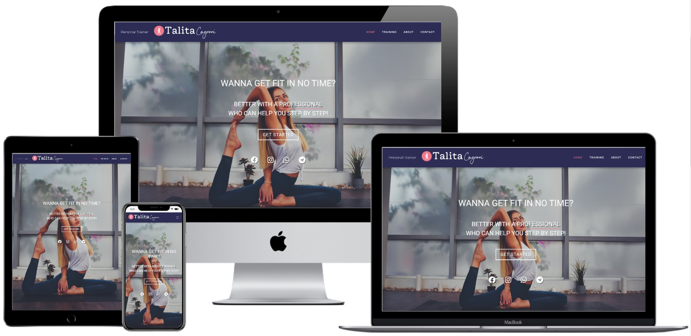

<h1 align="center">Talita Cagnoni - Personal Trainer Website</h1>

[View the live project here.](https://mathias-santanna.github.io/MS1-Talita)

This website was created for the purpose of completing the first Milestone Project for the Code Institute's Full Stack Developer course.But also is the main marketing website for Talita to share her services. It is designed to be responsibe and accessible on a range of devices, making it easy to navigate for potential clients and  ```.

<h2 align="center"></h2>

## User Experience (UX)

-   ### User stories

    -   #### First Time Visitor Goals

        1. Easily understand the main purpose of the site and learn more about the Professional and services offered.
        2. Eeasily navigate throughout the site to find content.
        3. Look for testimonials to understand what their users think of them and see if they are trusted. 
        4. Locate their social media links to see their followings on social media to determine how trusted and known they are.

    -   #### Returning Visitor Goals

        1. Find information about the services offered.
        2. Find the best way to get in contact with the professional with any questions I may have.
        3. Find social media links.

    -   #### Frequent User Goals
        1. Check to see if there are any newly added services.
        2. Check to see if there are any new testimonials posts.
        3. Sign up to the Newsletter so that I am emailed any major updates and/or changes to the website.

- ### Structure 
    -   Every page contain navigation menu at the top, which will direct them to the selected page. Logo on the right with the Brand image in it that show reinforce professionalism and care. On mobile the Nav Menu collapse to make a better use of space.

    - In the home page, hero image and sales picth centralized (big question) with the answer under with hightlight in the profesional, word, to be have maximum impact.

    -  **Call to action button** to direct the potential client to the Training Programs Options and also social icon links for easy access to social media for more content.

    -   In the Training Programs Page the visitor can find 4 diferent container of blog post, that make easy to locate and read through. And also motivational quotes in each one.

    -   A promotional video to illustrate a bit of the training.

    -   **Call to action button** to direct the potential client to the Contact Form page.

    -   In About page, a profile picture of the trainer and some background information. 

    -   In Testimonials there is some feedback from previus clients and their thoughts, a very important part of the website to boost the visitor trust and improve chances of contrat.

    -   More data, in form of icons, of previus contracts and clients

    -   Skills in form of progress bar, to enforce her degree of professionalim and experience.

    -   Contact form, simple and yet beutiful. Requests client name and email, subject , and below that a box to leave a message. On the bottom a **Submit button** and under, a Motivational quote to illustrate the fitness enviroment.

    -   Footer with all main social media, as another way of contact. 

-   ### Design
    -   #### Colour Scheme
        -   The two main colours used are Purple Space Cadet , and Rosé Ultra Red .
    -   #### Typography
        -   The Logo font on mobile is Pacifico, it is clean and reminds of a signature.
        -   The Roboto font is the main font used throughout the whole website with Trebuchet MS as the fallback font in case for any reason the font isn't being imported into the site correctly. Roboto font is a clean font used frequently in programming, so it is both attractive and appropriate.
    -   #### Imagery
        -   Brand is important for Talita personal maketing, it's purpose to be eye catching and also look like a signature.
        -   The large, background hero image is was choosen to be striking and catch the user's attention. It also has a modern, energetic aesthetic.

*   ### Wireframes

    -   [Home Page Wireframe](https://github.com/Mathias-SantAnna/MS1-Talita/blob/master/wireframes/Wireframe-Home.jpg)

    -   [Training Programs Page Wireframe](https://github.com/Mathias-SantAnna/MS1-Talita/blob/master/wireframes/Wireframe-Training.jpg)

    -   [About Page Wireframe](https://github.com/Mathias-SantAnna/MS1-Talita/blob/master/wireframes/Wireframe-About.jpg)

    -   [Contact Us Page Wireframe](https://github.com/Mathias-SantAnna/MS1-Talita/blob/master/wireframes/Wireframe-Contact.jpg)

## Features

-   Responsive on all device sizes

-   Interactive elements

-   Header Logo - Exists on every page and allows all users to easily recognise the name as signature brand. Clicking the logo returns users to the home page as they would expect.

-   Social Icons - Easy to access from home page, and footer. Allowing all users to access the social platforms that the artist uses.

-   Promotional Video - Show potential clients a bit of the work out and view some of her work. Creates connection and emotional response.

-   Call to Action Buttons - Guide potential clients through the process of viewing the Training Programs, know about the Personal Trainer and finally making first contact.

-   Testimonials - Review and feedback of the services offered, are the most important feature for potencial clients in order to trust the professional.

## Features to Implement in future

- GDPR compliant pop-up screen - Allows all new visitors to the website to approve or deny the processing of their personal data. Ensures the business complies with the EU data protection law. - Javascript Needed

- Add CAPTCHA to contact form - Allows business to protect the contact form from spam. - Javascript Needed
contact form Send button change from

- Send button change from Send to Processing and then when complete changes to Sent. - Javascript Needed

## Technologies Used

### Languages Used

-   [HTML5](https://en.wikipedia.org/wiki/HTML5)
-   [CSS3](https://en.wikipedia.org/wiki/Cascading_Style_Sheets)

### Frameworks, Libraries & Programs Used

1. [Bootstrap 4.4.1:](https://getbootstrap.com/docs/4.4/getting-started/introduction/)
    - Bootstrap was used to assist with the responsiveness and styling of the website.
1. [Hover.css:](https://ianlunn.github.io/Hover/)
    - Hover.css was used on the Social Media icons in the footer to add the float transition while being hovered over.
1. [Google Fonts:](https://fonts.google.com/)
    - Google fonts were used to import the 'Titillium Web' font into the style.css file which is used on all pages throughout the project.
1. [Font Awesome:](https://fontawesome.com/)
    - Font Awesome was used on all pages throughout the website to add icons for aesthetic and UX purposes.
1. [jQuery:](https://jquery.com/)
    - jQuery came with Bootstrap to make the navbar responsive but was also used for the smooth scroll function in JavaScript.
1. [Git](https://git-scm.com/)
    - Git was used for version control by utilizing the Gitpod terminal to commit to Git and Push to GitHub.
1. [GitHub:](https://github.com/)
    - GitHub is used to store the projects code after being pushed from Git.
1. [Picmonkey:](picmonkey.com)
    - Picmonkey was used to create the logo, resizing images and editing photos for the website.
1. [Balsamiq:](https://balsamiq.com/)
    - Balsamiq was used to create the [wireframes](https://github.com/) during the design process.
1. [Toolur:](https://compressimage.toolur.com/)
    - is used to reduce the file sizes of images before being deployed to reduce storage and bandwith.
1. [Favicon:](https://favicon.io/)
    - Favicon.io was used to make the site favicon
1. [Coolors:](https://coolors.co/)
    - is used to create the colour pallete for the entire website.
1. [Tecnisih:](http://techsini.com/multi-mockup/)
    - tecnisih.com Multi Device Website Mockup Generator was used to create the Mock up image in this README
1. [Google Chrome Developer Tools:](https://developers.google.com/web/tools/chrome-devtools)
    - Google chromes built in developer tools are used to inspect page elements and help debug issues with the site layout and test different CSS styles.


## Testing

The W3C Markup Validator and W3C CSS Validator Services were used to validate every page of the project to ensure there were no syntax errors in the project.

-   [W3C Markup Validator](https://jigsaw.w3.org/css-validator/#validate_by_input) - [Results](https://github.com/)
-   [W3C CSS Validator](https://jigsaw.w3.org/css-validator/#validate_by_input) - [Results](https://github.com/)

### Testing User Stories from User Experience (UX) Section


-   #### First Time Visitor Goals

    1. As a First Time Visitor, I want to easily understand the main purpose of the site and learn more about the organisation.

        1. Upon entering the site, users are automatically greeted with a clean and easily readable navigation bar to go to the page of their choice. Underneath there is a Hero Image with Text and a "Learn More" Call to action button.
        2. The main points are made immediately with the hero image
        3. The user has two options, click the call to action buttons or scroll down, both of which will lead to the same place, to learn more about the organisation.

    2. As a First Time Visitor, I want to be able to easily be able to navigate throughout the site to find content.

        1. The site has been designed to be fluid and never to entrap the user. At the top of each page there is a clean navigation bar, each link describes what the page they will end up at clearly.
        2. At the bottom of the first 3 pages there is a redirection call to action to ensure the user always has somewhere to go and doesn't feel trapped as they get to the bottom of the page.
        3. On the Contact Us Page, after a form response is submitted, the page refreshes and the user is brought to the top of the page where the navigation bar is.

    3. As a First Time Visitor, I want to look for testimonials to understand what their users think of them and see if they are trusted. I also want to locate their social media links to see their following on social media to determine how trusted and known they are.
        1. Once the new visitor has read the About Us and What We Do text, they will notice the Why We are Loved So Much section.
        2. The user can also scroll to the bottom of any page on the site to locate social media links in the footer.
        3. At the bottom of the Contact Us page, the user is told underneath the form, that alternatively they can contact the organisation on social media which highlights the links to them.

-   #### Returning Visitor Goals

    1. As a Returning Visitor, I want to find the new training programs.

        1. These are clearly shown in the banner message.
        2. They will be directed to a page with blog posts of Training Programs and call to action.

    2. As a Returning Visitor, I want to find the best way to get in contact with the professional with any questions I may have.

        1. The navigation bar clearly highlights the "Contact Us" Page.
        2. Here they can fill out the form on the page or are told that alternatively they can message the professional on social media.
        3. The footer contains links to the organisations Facebook, Twitter and Instagram page.
        4. Whichever link they click, it will be open up in a new tab to ensure the user can easily get back to the website.
        

-   #### Frequent User Goals

    1. As a Frequent User, I want to check to see if there are any newly added challenges or hackathons.

        1. The user would already be comfortable with the website layout and can easily click the banner message.

    2. As a Frequent User, I want to check to see if there are any new blog posts.

        1. The user would already be comfortable with the website layout and can easily click the blog link

    

### Further Testing
Tests table 
-   The Website was tested on Google Chrome, Opera, Microsoft Edge and Safari browsers.
-   The website was viewed on a variety of devices such as Desktop, Laptop, iPhone7, iPhone 8 & iPhoneX.
-   A large amount of testing was done to ensure that all pages were linking correctly.
-   Friends and family members were asked to review the site and documentation to point out any bugs and/or user experience issues.

### Known Bugs

-   On some mobile devices the Hero Image pushes the size of screen out more than any of the other content on the page.
    -   A white gap can be seen to the right of the page.
-   On some mobile devices, the navbar when scrolled down shrinks a bit, but when scrolled up it cames back to it's regular size.
    -   I tried to change the logo tor text but it didn't worked out.


## Deployment

### GitHub Pages

The project was deployed to GitHub Pages using the following steps...

1. Log in to GitHub and locate the [GitHub Repository](https://github.com/)
2. At the top of the Repository (not top of page), locate the "Settings" Button on the menu.
    - Alternatively Click [Here](https://raw.githubusercontent.com/) for a GIF demonstrating the process starting from Step 2.
3. Scroll down the Settings page until you locate the "GitHub Pages" Section.
4. Under "Source", click the dropdown called "None" and select "Master Branch".
5. The page will automatically refresh.
6. Scroll back down through the page to locate the now published site [link](https://github.com) in the "GitHub Pages" section.


### Making a Local Clone

1. Log in to GitHub and locate the [GitHub Repository](https://github.com/)
2. Under the repository name, click "Clone or download".
3. To clone the repository using HTTPS, under "Clone with HTTPS", copy the link.
4. Open Git Bash
5. Change the current working directory to the location where you want the cloned directory to be made.
6. Type `git clone`, and then paste the URL you copied in Step 3.

```
$ git clone https://github.com/YOUR-USERNAME/YOUR-REPOSITORY
```

7. Press Enter. Your local clone will be created.

```
$ git clone https://github.com/YOUR-USERNAME/YOUR-REPOSITORY
> Cloning into `CI-Clone`...
> remote: Counting objects: 10, done.
> remote: Compressing objects: 100% (8/8), done.
> remove: Total 10 (delta 1), reused 10 (delta 1)
> Unpacking objects: 100% (10/10), done.
```

Click [Here](https://help.github.com/en/github/creating-cloning-and-archiving-repositories/cloning-a-repository#cloning-a-repository-to-github-desktop) to retrieve pictures for some of the buttons and more detailed explanations of the above process.

## Credits

### Code

-   The full-screen hero image code came from this [StackOverflow post](https://stackoverflow.com)

-   [Bootstrap4](https://getbootstrap.com/docs/4.5/examples/blog/): Blog Post Template code copied and modified.

-   [Bootstrap4](https://getbootstrap.com/docs/4.4/getting-started/introduction/): Bootstrap Library used throughout the project mainly to make site responsive using the Bootstrap Grid System.

-   [MDN Web Docs](https://developer.mozilla.org/) : For Pattern Validation code. Code was modified to better fit my needs and to match an Irish phone number layout to ensure correct validation. Tutorial Found [Here](https://developer.mozilla.org/en-US/docs/Web/HTML/Element/input/tel#Pattern_validation)

### Content

-   All content was written by the developer or from it's client source @ Talita Canoni.

-   Hero Image: [Rawan Yasser](https://unsplash.com/@rawanyasser?utm_source=unsplash&utm_medium=referral&utm_content=creditCopyText)

-   Content based on [Why Is Clinical Pilates different to other Pilates Classes? ](https://www.gophysiotherapy.co.uk/blog/why-is-rehabilitation-pilates-different-to-other-pilates-classes/
### Media

-   All Images were created by the developer.

### Acknowledgements

-   My Mentor for continuous helpful feedback.

-   Tutor support at Code Institute for their support.
